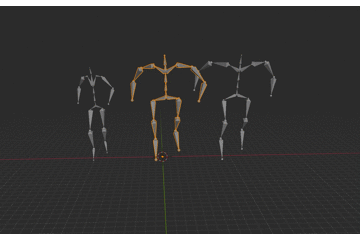

# Skeleton-Aware Networks for Deep Motion Retargeting
Reproduce the paper [Skeleton-Aware Networks for Deep Motion Retargeting](https://arxiv.org/abs/2005.05732) of [Kfir Aberman](https://kfiraberman.github.io), [Peizhuo Li](https://peizhuoli.github.io/).
Most of the pre-processing and post-processing codes which deal with motion capture files are borrowed from their github
in [Skeleton-Aware Networks for Deep Motion Retargeting](https://deepmotionediting.github.io/retargeting) 

### Requirements
Pytorch >= 1.3.1

### Demo
from left to right: input, target, output


 <br>

 <br>

### Quick Start
Just run
```bash
python inference.py
```

The output bvh files will be saved in the folder
```bash
./pretrained/result/
```

### Train
Run
```bash
python train.py
```
It will train the network which could retarget the motion of "Aj" to "BigVegas" which are 2 different
characters from the "Mixamo" dataset.
Please note: The architectures of the neural networks are based on the topologies of the skeletons.So if you'd like train a model with
your customized skeletons. You might need to change some variables related with the topologies which
defined in the
```bash
./model/skeleton.py
``` 
also the names of joints defined in the
```bash
./datatsets/bvh_parser/py
```
An automatic way to generate the skeleton structure after skeleton pooling might be released in the future.

Learning curves showed below:


### Note
There are some changes compared with code released by the author:
1. I re-implement the architecture of the neural network. I use nn.Conv2d instead of
nn.Conv1d for the skeleton convolution, because I think 2D convolution is more in line with the description about skeleton
convolution according to the paper.

2. GAN part are deprecated(bad memories with it, training GAN needs lots of tricks). Learning to walk before you run.
So, technically my training process is in a "paired"(supervised) mode.

3. About the loss designing, I haven't add the end-effector loss into the training pipeline, multi-task losses training needs
tricks too.

3. IK optimization has not been implemented.

## Citation
If you use this code for your research, please cite their fancy paper:
```
@article{aberman2020skeleton,
  author = {Aberman, Kfir and Li, Peizhuo and Sorkine-Hornung Olga and Lischinski, Dani and Cohen-Or, Daniel and Chen, Baoquan},
  title = {Skeleton-Aware Networks for Deep Motion Retargeting},
  journal = {ACM Transactions on Graphics (TOG)},
  volume = {39},
  number = {4},
  pages = {62},
  year = {2020},
  publisher = {ACM}
}
```
